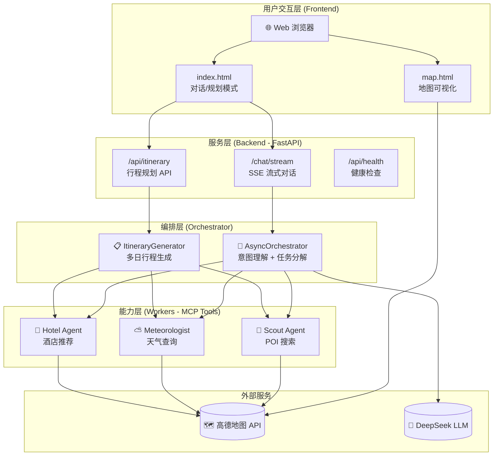
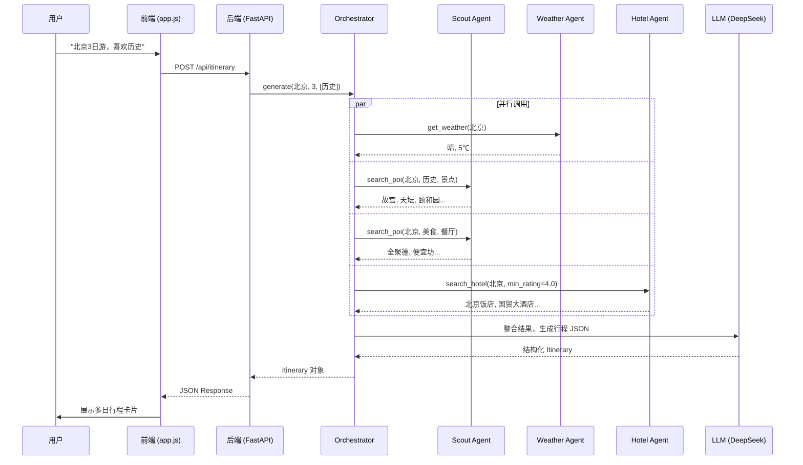
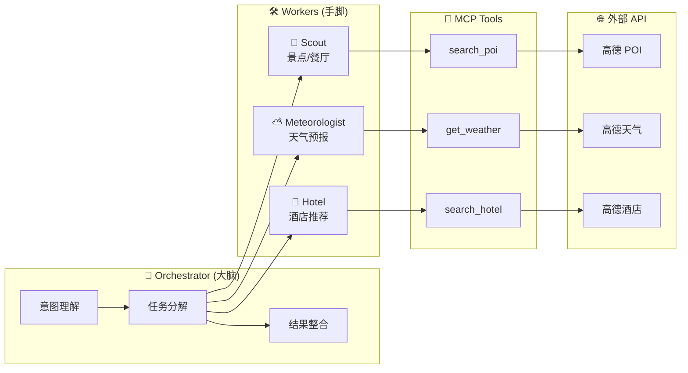

# 🏗️ 系统架构图

## 1. 整体架构 (分层视图)



---

## 2. 数据流时序图



---

## 3. Agent 协作关系图



---

## 4. 文件结构图

```
HelloAgents-Demo/
├── 📁 src/
│   ├── 📁 phase3/          # Orchestrator 核心
│   │   ├── orchestrator.py  # 主编排器
│   │   ├── system_prompts.py
│   │   └── models.py
│   │
│   ├── 📁 phase4/          # Worker Agents
│   │   ├── scout_agent.py   # 景点/餐厅搜索
│   │   ├── weather_agent.py # 天气查询
│   │   └── hotel_agent.py   # 酒店推荐 ⭐新增
│   │
│   ├── 📁 phase6/          # FastAPI 后端
│   │   ├── main.py          # API 入口
│   │   └── async_agent.py   # 异步 Agent
│   │
│   ├── 📁 phase7/          # 前端 UI
│   │   ├── index.html       # 主页面
│   │   ├── map.html         # 地图页面
│   │   ├── app.js           # 前端逻辑
│   │   └── doraemon.css     # 主题样式
│   │
│   └── 📁 phase8/          # 行程生成器 ⭐新增
│       ├── models.py        # Pydantic 模型
│       └── itinerary_generator.py
│
├── 📁 learning_docs/        # 学习文档
└── 📁 interview_prep/       # 面试材料
```

---

## 5. 技术栈总览

| 层级 | 技术选型 | 说明 |
|-----|---------|-----|
| LLM | DeepSeek Chat | 中文优化，性价比高 |
| Agent 框架 | HelloAgents + FastMCP | 轻量、透明、教学友好 |
| 后端 | FastAPI + Uvicorn | 异步高性能，SSE 支持 |
| 数据校验 | Pydantic V2 | 强类型，自动序列化 |
| 前端 | Vanilla JS + 高德 JS API | 无框架依赖，原生实现 |
| 地图服务 | 高德 Web Service API | POI/天气/路线 |
